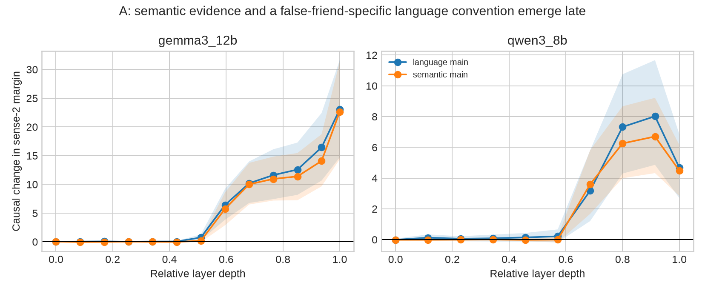
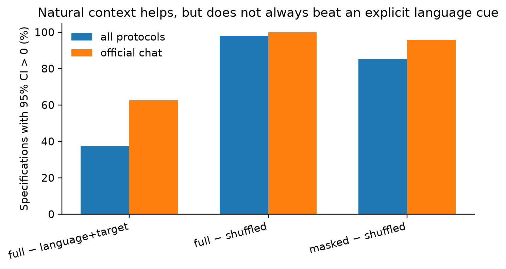
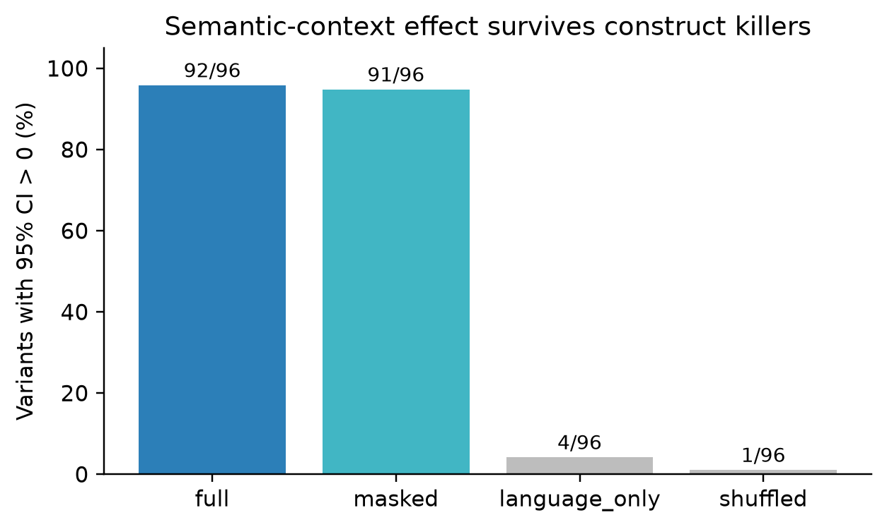

# When Context and Language Disagree

This repository records a sequence of kill-or-go pilots on cross-lingual
homographs, including a completed three-candidate audit on 2026-08-11.

1. **Semantic overwrite is KILLED.** Its apparent adaptation effect is explained
   by surface/candidate exposure and disappears after the appropriate control.
2. **Auditing cross-lingual sense disambiguation beyond accuracy is GO.** A new
   exact-form 2×2 experiment separates sentence-language convention from
   sense-bearing context and shows that both contribute to the score movement
   hidden behind many absolute errors.

After independent natural-context validation, cross-turn robustness tests and
causal activation patching, the conservative working title is now:

> **When Context and Language Disagree: Disentangling Cross-Lingual Lexical
> Arbitration in Multilingual LLMs**

`Causal Decomposition` is reserved for the paper title only if the bilingual
measurement and human-validated pre-matched-control gates pass.

The scientific question is broader than another false-friend leaderboard:

> When a multilingual model answers a lexical-semantic item incorrectly, did it
> fail to extract contextual evidence, or did correct evidence fail to overcome
> a language- and answer-dependent decision bias?

The new decisive behavioral result is that, on 354 independently authored
bidirectional Doppelganger-JC items, target-masked natural context beats matched
unrelated context for **4/4 models**, while restoring the cross-lingual
homograph often reduces rather than improves the margin. Exploratory layer-wise
causal patching on Qwen3-8B and Gemma-3-12B suggests a general-WSD-like semantic
profile plus a possible later language-convention effect; the
false-friend-specific confirmatory claim remains locked pending bilingual
validation and rematching. Cross-turn carryover is not retained as a standalone
topic because its homograph-specific increment is less stable under a changed
prime role.

A subsequent formal-gate audit adds two non-CJK replications: masked natural
context beats marker-matched unrelated context in **48/48** Indonesian–Malay /
Indonesian–Tagalog model × wrapper × normalization variants. Target-span
interventions replicate causal semantic and language effects in both Qwen3-8B
and Gemma-3-12B, chiefly in the residual stream and MLP output; attention-only
effects are not stable. The audit also found that the original control pool had
**zero pairs** under exact bilingual broad-POS matching plus a 1-SD caliper on
every frequency/tokenization/gloss/difficulty covariate. This is a failed
common-support gate, not evidence that matching succeeded.

The final design-stage repair constructs controls from JMdict, CC-CEDICT and
natural Tatoeba contexts before reading target-model outcomes. Joint cardinality
matching retains 24/27 false friends and 24 controls in each of the true-friend
and different-form translation groups; every preregistered covariate has
`|SMD| < .10` (max .0872/.0972). A 4× human-validation reservoir (96 candidates
per control group) is frozen because dictionary overlap does not establish
sense validity. Confirmatory target-model analysis is deliberately locked until
two bilingual annotators validate both Doppel and control packets.

Following advisor feedback on 2026-08-12, the scientific question is now stated
as failure localization: when context semantics and language convention
conflict, does the model fail to extract semantic evidence or does that evidence
lose during lexical arbitration? The identification design now has five word
types: false friends, true friends, dictionary-operationalized language-specific
words, different-form translations and monolingual polysemy. Outcome-blind
language-specific matching retains 23 Chinese and 24 Japanese controls with max
`|SMD|=.0945/.0967`; a 4× bilingual-validation reservoir contains 92/96 items.
These remain candidates—not validated gold—until the human gate passes.



## Construct-killer result

StingrayBench already contains four human-authored cells for each false friend:
`L1×sense1`, `L2×sense1`, `L1×sense2`, and `L2×sense2`. The old pilot used only
the two aligned diagonal cells. The new audit uses all four and estimates:

```text
semantic-context effect = [(m12 + m22) - (m11 + m21)] / 2
language-convention effect = [(m21 + m22) - (m11 + m12)] / 2
interaction = (m22 - m21) - (m12 - m11)
```

Here `mLS` is the log-probability margin for sense 2 over sense 1 under language
`L` and sense-bearing context `S`. The experiment keeps only NFKC-identical
forms that also occur literally in all four contexts: 27 ZH–JA and 33 ID–TL
false friends. This stricter context-occurrence check removes composite forms,
inflections and rows where a translated synonym replaced the listed target.

Across four Qwen/Gemma checkpoints, plain and official chat formatting, mean and
sum log likelihood, and three answer wrappers:

- full-context semantic effect: **92/96 variants with 95% CI > 0**;
- official chat-template subset: **48/48** (plain-text stress test: 44/48);
- target-masked semantic context: **91/96**;
- language-only control: **4/96 positive and 2/96 negative**;
- marker-matched shuffled-context control: **1/96 positive and 3/96 negative**;
- independently written lexical gloss variants: **48/48 aggregate CIs > 0**.

An ecological check uses only Stingray's two natural correct-use cells, never
the translated/replaced conflict cells. Masked natural context beats a
marker-matched unrelated context in **82/96** variants (**46/48** with official
chat templates). In contrast, natural context beats an explicit
language-plus-target cue in only **36/96**, with 16 significant reversals. The
safe conclusion is therefore protocol-dependent evidence use—not that context
always dominates language identity.



Thus the diagonal switch is not merely language identification. It contains a
replicable sense-bearing-context component and a language-convention component.
Absolute two-direction correctness can nevertheless remain as low as 3–46%,
depending on model and prompting.



## Terminology correction

The previous `(m1+m2)/2` quantity is now called the **diagonal margin midpoint**,
not a candidate prior. A coordinate midpoint is descriptive and does not
causally identify a prior. Decision bias is estimated separately with
content-free prompts and repeated answer formulations.

Content-free calibration changes the average both-directions accuracy from
31.9% to 46.5% on ZH–JA and from 41.0% to 55.2% on ID–TL. This is evidence that
absolute conclusions depend materially on the decision layer; calibration
itself is an existing baseline, not our novelty claim.

## Reproduction

The pilot used Python 3.12, PyTorch 2.8, Transformers 4.57, PEFT 0.19 and A100
GPUs. On this cluster `/usr/bin/python` is Python 2, so use an explicit Python 3
environment. For example:

```bash
uv venv .venv --python 3.12
uv pip install --python .venv/bin/python -r requirements.txt
```

Then obtain datasets under their own licenses:

```bash
git clone https://github.com/0017-alt/Doppelganger-JC external/Doppelganger-JC
git clone https://huggingface.co/datasets/StingrayBench/StingrayBench external/StingrayBench
.venv/bin/python src/prepare_data.py
```

Example construct audit:

```bash
CUDA_VISIBLE_DEVICES=0 .venv/bin/python src/evaluate_factorial.py \
  --pair zh_ja --model Qwen/Qwen2.5-7B-Instruct --tag qwen25_7b \
  --data-root external/StingrayBench/data --prompt-mode chat --batch-size 32
.venv/bin/python src/analyze_factorial.py
.venv/bin/python src/validate_construct.py
```

Raw licensed text, model weights, adapters and per-item result files are not
redistributed. Deterministic code, manually inspectable gloss variants,
aggregate CSVs, reports and figures are included.

## Read next

- [`docs/RESEARCH_STATUS_AND_EVIDENCE_ZH.md`](docs/RESEARCH_STATUS_AND_EVIDENCE_ZH.md): **canonical topic, A/B/C mapping, results, evidence boundaries, and next gates**
- [`docs/FINAL_MEASUREMENT_HANDOFF_ZH.md`](docs/FINAL_MEASUREMENT_HANDOFF_ZH.md): frozen final gates, results, and exact handoff
- [`docs/RESEARCH_PROPOSAL.md`](docs/RESEARCH_PROPOSAL.md): revised six-month plan
- [`docs/EXPERIMENTS.md`](docs/EXPERIMENTS.md): complete experiment record
- [`docs/LITERATURE_REVIEW.md`](docs/LITERATURE_REVIEW.md): novelty boundaries

This remains a pilot, not a finished paper. Independent bilingual validation of
the new glosses, natural non-contrastive contexts, additional datasets, and a
hierarchical measurement model remain mandatory before a strong publication
claim.
