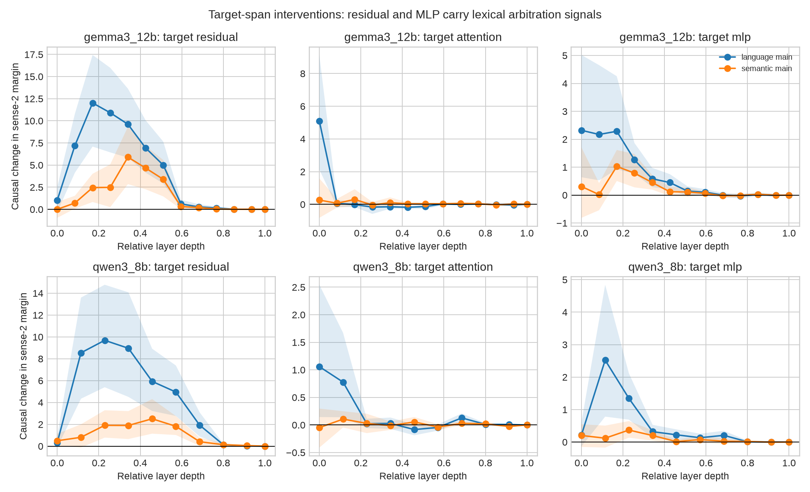

# 最终三道 Gate 审计与导师汇报稿（2026-08-11）

## 结论

推荐保留的题目是：

> **When Context and Language Disagree: Causal Decomposition of Cross-Lingual Lexical Arbitration**
> **文脈と言語慣習が衝突するとき：多言語 LLM における語義選択の因果的分解**

它不是新的同形词 accuracy benchmark。核心问题是：当 sentence context 指向一个词义、而语言惯例和共享表记偏向另一个词义时，多语言模型在哪个阶段、通过什么表示成分完成仲裁？cross-lingual homograph 是可控实验床，母问题覆盖 multilingual lexical choice、code-switching、MT terminology 与 multilingual assistants。

截至本轮，**行为主张 B 为 GO，非 CJK 一般性 Gate 已通过；机制主张 A 获得新的跨模型 target-token/MLP 因果证据，但严格 matched-control Gate 未通过；Doppel 的人工双语验收尚未完成。** 所以这是可以向导师汇报、值得进入下一阶段的数据支撑题目，但还不能冒充三道门全部闭合的完成论文。

## Gate 1：Doppel 354 项人工双语验收

状态：**待人工，不能自动替代。**

已经完成可直接交付两位标注者的完整设施：

- 354 个词 × 两方向，共 708 个判断/标注者；
- 两份独立随机顺序、A/B 候选独立盲化的 CSV；
- 私有 unblinding key、adjudication 模板和 manifest；
- `docs/BILINGUAL_ANNOTATION_PROTOCOL_ZH.md` 规定自然度、语义等价、唯一性、污染类型、保留规则和 agreement 计算；
- 自动风险审计已覆盖 708 行，但只用于分层，不当作 gold：158 行至少一侧为单字，112 行候选长度比大于 2，50 行含标点，14 行存在 substring relation，3 行完整译文长度差大于 10。

生成命令：

```bash
PYTHONPATH=src .venv/bin/python src/prepare_bilingual_annotation.py \
  --data-root external/Doppelganger-JC
```

正式保留条件：两位中日双语标注者独立判断，分歧 adjudication；报告 Cohen's kappa/百分比一致率及被剔除比例。若不自然或不等价项目比例过高，Doppel confirmation set 必须重建，不能靠自动规则圆回来。

## Gate 2：第二个非 CJK 语言对

状态：**通过。**

使用 StingrayBench 中严格 NFKC exact form 且目标真实出现的自然 diagonal cells：

- Indonesian–Malay：30 items；
- Indonesian–Tagalog：33 items；
- 两方向先在 item 内平均；
- full、target-masked、同语言 marker-matched unrelated、surface-only；
- Qwen2.5-7B、Qwen3-8B、Gemma-3-4B、Gemma-3-12B；
- bare/definition/refers 三种候选包装，mean/sum 两种 normalization。

最关键的 `masked natural context − matched unrelated context` 在两个语言对、4 个模型的 **48/48 model × pair × wrapper × normalization 变体中 CI 全部大于 0**。`full − unrelated` 同样为 48/48。中位效应如下：

| pair | model | masked − unrelated median |
|---|---|---:|
| ID–MS | Qwen2.5-7B | +2.424 |
| ID–MS | Qwen3-8B | +4.055 |
| ID–MS | Gemma-3-4B | +8.984 |
| ID–MS | Gemma-3-12B | +4.709 |
| ID–TL | Qwen2.5-7B | +2.729 |
| ID–TL | Qwen3-8B | +3.510 |
| ID–TL | Gemma-3-4B | +8.155 |
| ID–TL | Gemma-3-12B | +6.235 |

与日中 Doppel 中“放回表记常抵消上下文”的模式不同，ID–MS/ID–TL 的 `full − masked` 多数为正。这不是失败，而是一个重要 interaction：**context extraction 的存在跨文字系统稳定，但 surface-form 与 context 的结合是语言对相关的。** 因而主张应是 lexical arbitration 的可分解性，而不是“同形表记总会抑制上下文”。

## Gate 3a：frequency/POS/difficulty 严格匹配

状态：**旧控制池未通过 common-support Gate；新的 outcome-blind pre-matching 计算 Gate 已通过，人工效度待完成。**

协变量包含中日 `wordfreq`、两语言频率差、token 数、gloss 长度/长度差、原始 donor difficulty；POS 分别由 jieba 与 fugashi/UniDic 提取。完整 Hungarian assignment 后，false-friend language excess 在 Qwen3 与 Gemma-12B、相对 true-friend 与 different-form translation controls 均为正且 bootstrap CI 不跨 0。

但是这不能称为严格匹配结果：多项匹配后 |SMD| 仍大于 1。进一步施加“双语 broad POS 完全相同 + 每个连续协变量均在 1 SD caliper 内”的硬门槛时，两个模型、两类 control 都得到 **0 个可匹配对**。1.5 SD 也只有 Qwen 的 2/1 对，Gemma 为 0/0；只有放宽到 2 SD 才有 6–9 对。

因此正确结论不是“控制后证实”，而是：

> 现有 20 false friends 与 Stingray common-word controls 不在足够的共同支持域；当前数据无法识别严格 matched 的 false-friend excess。

该要求已经执行：从 JMdict、CC-CEDICT 与 Tatoeba 构造 11,000 个带双语自然语境候选，在 target outcomes 未读取时用 joint cardinality matching 同时匹配两类 controls。结果保留 24/27 false friends、每类 24 controls，所有预注册协变量最大 `|SMD|` 为 0.0872 / 0.0972。为处理人工剔除，又冻结每类 96 个的 4× validation reservoir，仍满足 `|SMD| < .10`。两位双语者必须验证语义、自然度、POS 与 confounds；只有双人均通过的 controls 才重新匹配。若人工验证后少于 20 组、平衡失败或 target excess 消失，删除 collision-specific mechanism 主张，只保留行为分解 B。完整交接见 `FINAL_MEASUREMENT_HANDOFF_ZH.md`。

## Gate 3b：target-token 与 attention/MLP 因果干预

状态：**target residual 与 MLP 通过跨模型重复；attention 未通过稳定通路标准。**

在固定 neutral recipient 和固定英文候选下，把 contextual donor 中目标词 span 的平均状态 patch 到 recipient 的目标词 span。对 Qwen3-8B 和 Gemma-3-12B 每 4 层测试：整层 residual、self-attention output、MLP output。

- target residual 的 semantic effect：两模型各 8 个采样层 CI 大于 0；false-friend 与 monolingual polysemy 的层曲线相关为 0.921 / 0.820；
- target residual 的 language effect：Qwen 层 4–28、Gemma 层 4–36 显著；相对 true-friend 与 translation controls 的 excess 在两模型早中层连续显著；
- MLP output 复现主要 language signal：Qwen 层 4–24、Gemma 层 0–20；也复现一部分 semantic signal；
- attention output 只有零散显著层，方向和位置不稳定，不能称为主要 pathway；
- 最后一层 target patch 为零是预期的 causal-graph sanity check：同一层目标位置不能逆向影响已经过去的 answer position；早中层 patch 则能通过后续层传播。

因此可以说：**目标词表示中的语义与语言惯例信息对后续 lexical decision 有因果作用，MLP 分量足以复现相当一部分 effect。** 不能说已找到专属 circuit、具体 neuron 或 attention head。



## 文献边界

定向检索确认了最接近的边界：

- StingrayBench 与 Doppelganger-JC 已经证明 false-friend errors/homograph shortcut，不能把“模型会错”当贡献；
- *Separating Tongue from Thought* 已用 activation patching 因果分离语言与概念表示；
- *When Meanings Meet* 已研究跨语言 shared concept spaces 和 homograph/polysemy copying；
- EACL 2026 的 *Tug-of-war between idioms' figurative and literal interpretations* 已对单语言 idiom ambiguity 做 attention/MLP causal tracing，说明“上下文与 lexical prior 的竞争机制”正在升温，也意味着本题必须依靠 cross-lingual language × sense factorial 和 matched controls 区分自己；
- ACL 2026 的 Galician–Portuguese–Spanish 工作继续显示 lexical overlap 的 semantic interference，但仍是行为评估，不闭合本研究的 causal decomposition。

截至 2026-08-11，没有检索到同时结合以下四点的直接同题工作：exact-form false friends 的 `Language × Sense` crossed factorial、独立 natural-context replication、matched lexical controls、同一分解量上的 target-span component intervention。正式写作只能表述为“we did not identify prior work combining ...”，不能写“世界首次”。

## 给导师的三句话

1. 我们不再研究静态“LLM 会不会被同形词骗”，而研究 context evidence 与 language convention 冲突时的 multilingual lexical arbitration。
2. 行为分解已在日中独立资源以及两个非 CJK 语言对、四个模型上复现；target-token causal patching 又在 Qwen/Gemma 上把效应追到早中层 residual 与 MLP，而 attention 结果不稳定。
3. 现在最关键的风险不是算力，而是 measurement：Doppel 需要两位双语者验收；现有 controls 无严格共同支持域，必须先构建 frequency/POS/tokenization/difficulty matched controls，失败就删掉 collision-specific mechanism claim。

## 最小可用 idea

名称：**Crossed Lexical Arbitration (CLA)**。

1. 用 `sentence language × contextual sense` 完全交叉设计识别 semantic、language-convention 与 interaction；
2. 用 natural diagonal contexts 验证不是翻译构造伪影；
3. 用 bilingual-reviewed lexical options 控制答案边界；
4. 在预匹配的 false/true/different-form controls 上做 target residual、MLP/attention interchange intervention；
5. 只有前四步通过，才测试 collision-aware activation steering，并和 random/generic direction 等预算比较。

这是一个六个月可执行的硕士题目：行为 measurement 是稳固主贡献，因果机制是高价值但受严格 Gate 约束的第二贡献；mitigation 是可删的第三贡献，不反过来绑架题目。
