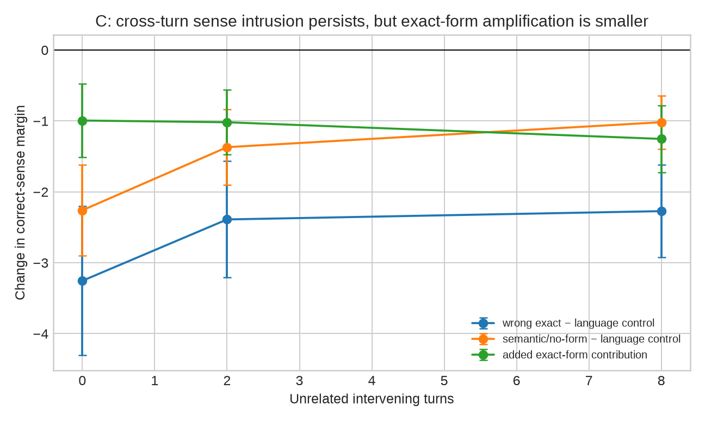
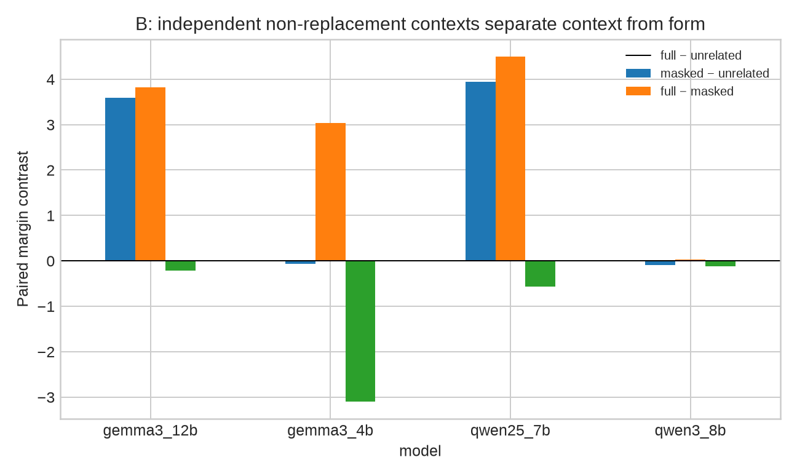

# 三个候选的完整验证与最终收束（2026-08-11）

## 结论先行

三个候选都已按预先写下的 kill criteria 做了真实推理实验，而不是只做文献推测。

| 候选 | 实验结论 | 选题结论 |
|---|---|---|
| A. Language Gating vs General WSD | **两者同时存在**：普通 polysemy 与 false friend 的 semantic causal profile 几乎同形，但 false friend 另有晚层、跨控制显著的 language-convention effect | **条件 GO**；不能写成“发现一个特殊 circuit”，应与 B 合并为 arbitration mechanism |
| B. XCA / benchmark construct decomposition | 在独立 Doppelganger-JC 非替换上下文上复现；而且发现表记放回后会抵消上下文证据 | **强 GO**；目前实证最稳，是主线骨架 |
| C. Cross-turn semantic carryover | 默认协议有强 sense-specific persistence，但 exact-form 增量较小，assistant-prime 复现只在一半 model×pair 组合显著 | **主线 KILL / 只留附属分析** |

最终建议不是机械选择 A 或 B，而是把两者合并成一个有宽度、又有单一科学问题的课题：

> **When Context and Language Disagree: Causal Decomposition of Cross-Lingual Lexical Arbitration**  
> **上下文与语言惯例冲突时，多语言 LLM 如何仲裁跨语言词义？**

cross-lingual homograph 是干净的冲突实验床，母问题是 multilingual model 如何在 lexical form、sentence language、contextual semantics 和 decision prior 之间仲裁。B 提供可复现的行为/测量分解，A 提供因果机制；这比单独做 benchmark、层图或一个 prompt recency 效应更完整。

## 实验范围

### C：跨轮语义残留

- 数据：StingrayBench 严格 exact-form 子集，ZH–JA 27 项、ID–TL 33 项；每项两个 target direction。
- 模型：Qwen2.5-7B-Instruct、Qwen3-8B、Gemma-3-4B-IT、Gemma-3-12B-IT。
- 条件：wrong exact、wrong semantic without form、same-language unrelated、surface-only、correct exact。
- dose：1/4/8；lag：0/2/8；最终 target prompt 完全相同，候选全部是英文释义。
- 主运行：22,080 个 condition cells；每 cell 计算两个候选的 exact continuation log-probability。
- 稳健性运行：Qwen3/Gemma-12B，prime 从 user turn 改为 assistant turn，共 3,840 cells。
- 推断：按 item 聚类的 paired bootstrap，先合并两个 target directions，再 bootstrap item。

主协议（mean-logp，72 个 model×pair×dose×lag cells）得到：

| 对比 | 方向符合且 CI 不跨 0 | median effect |
|---|---:|---:|
| wrong exact − language unrelated | 56/72 | -2.099 |
| wrong semantic/no-form − language unrelated | 44/72 | -1.325 |
| wrong exact − wrong semantic/no-form | 32/72 | -0.685 |
| wrong exact − surface-only | 20/72 | -0.916 |
| correct exact − language unrelated | 71/72 | +10.726 |

结果说明跨轮 semantic state 确实能跨语言持续，并非纯输出语言切换；lag=8 时 wrong-exact effect 的跨协议 median 仍为负。但它没有通过“必须是 homograph-specific”的最严要求：不用同形词的 semantic prime 已能产生强效应，exact-form 的额外贡献更小；换成 assistant-prime 后，wrong-exact vs language-control 只在 6/12 个 model×pair×lag cells 显著。方向没有普遍翻转，但稳健性不足以支撑独立主课题。因此 C 不作为最终选题。

## B：独立 natural non-replacement validation

### 为什么重做

旧 XCA 已在 Stingray 的完整 `Sentence Language × Intended Sense` crossed cells、matched marker、gloss variants、content-free calibration 和自然 diagonal cells 上通过。最大剩余风险是 crossed contexts 含 translated/replaced construction，可能并非自然语言现象。

### 新验证

- 独立资源：Doppelganger-JC 的人工 meaning/context/translation questions。
- 严格对齐后得到 354 个日中词，每项 JA→ZH 与 ZH→JA 两个独立、人写、非简单替词的 source contexts。
- 从 benchmark 的 correct translation 与 `wrong1` homograph-shortcut translation 自动截取最小不同片段作为两个 lexical rendering options。
- 两种 A/B 顺序全部运行并先平均，排除答案位置偏置。
- 四个条件：完整标记上下文、遮掉目标但保留上下文、同语言无关且 marker-matched 上下文、仅表记。
- 四个模型，共 22,656 个 order-averaged前的 evaluation rows；统计单位始终是 354 个词，两个方向先平均。

mean-logp paired result：

| 模型 | full − unrelated | masked − unrelated | full − masked |
|---|---:|---:|---:|
| Qwen2.5-7B | +3.940 [2.932, 4.921] | +4.500 [3.625, 5.378] | -0.560 [-1.250, 0.105] |
| Qwen3-8B | -0.095 [-0.112, -0.078] | +0.026 [0.015, 0.037] | -0.121 [-0.135, -0.107] |
| Gemma-3-4B | -0.067 [-0.709, 0.593] | +3.033 [2.504, 3.570] | -3.101 [-3.586, -2.623] |
| Gemma-3-12B | +3.594 [2.920, 4.269] | +3.815 [3.215, 4.390] | -0.220 [-0.684, 0.240] |

关键不是“又有一个 context effect”，而是：

1. **4/4 模型在目标表记被遮掉后，真实 surrounding context 都显著优于同语言无关上下文。** 这在完全独立的数据生成过程上支持 SCE。
2. **把同形表记放回后，3/4 模型显著变差或无改善；没有一个模型显著改善。** 模型可以读懂上下文，但 surface/language convention 会抵消已经存在的证据。
3. raw full-margin 排名与 context-adjusted 排名交换了 Qwen3 与 Gemma-4B 的次序。分解会改变至少一部分模型比较和错误诊断，不只是给原 accuracy 加一列。

因此 B 没触发 `natural SCE disappears + no conclusion changes` 的联合 kill gate，反而得到更清楚的 construct claim。

### 限制

Doppelganger 的 source contexts 和 translations 是人工资源，但本实验的“最小翻译差异片段”由确定性字符串规则抽取，尚未经过两名 bilingual reviewers。正式论文仍需 blind review 这些 option spans，并在另一语言对做 independent validation。这里可以证明 pilot 现象，不可冒充最终 gold test set。

## A：语言惯例还是普通 WSD？

### 设计

统一 direct-answer continuation task，所有跨语言候选输出为英文释义；Qwen3 显式关闭 thinking，避免把直接词义续写评分落在 reasoning 起始状态。

四组为：

- 20 exact false friends（Stingray ZH–JA 四个 crossed cells）；
- 20 exact true friends；
- 16 different-form/same-meaning translation controls；
- 20 English monolingual polysemy items（Princeton WordNet 的人工例句/释义，两个 sense 属于不同 lexicographer files）。

对每个 contextual donor，记录每 4 层的 answer-boundary residual state，再把它 patch 到固定 neutral recipient 的同一位置。recipient 和所有英文 candidates 不变，所以 language effect 不是“模型换了输出语言”。共得到 Qwen3 4,608 与 Gemma-12B 5,760 个 candidate scores。

### 结果

- behavioral accuracy：false friend 为 0.65/0.70，monolingual polysemy 为 0.625/0.675；true/translation controls 接近 1.0。false friend 并不比难度未匹配的普通 polysemy 明显更差。
- causal patch 在两个模型均能显著改变 sense margin，不是 probe-only result。
- false-friend semantic curve 与 monolingual polysemy curve 的相关为 **0.982（Qwen3）/0.999（Gemma-12B）**，peak layer 完全一致。这支持共享的一般 WSD pathway，而不是 false-friend 独有的 semantic circuit。
- 但 false friend 另有强 late language main effect。相对 true-friend 与 different-form controls 的 language-excess，在 Qwen3 最后 3 个采样层、Gemma 从约 0.58 relative depth 后连续显著。
- 两个模型方向与深度区间一致；English candidate 固定，排除了单纯 output-language switch。

最诚实的解释是：

> **cross-lingual homograph 使用普通 lexical-semantic resolution 通路，但在较晚的 answer arbitration 阶段，language convention 对同形冲突施加额外偏置。**

这同时否定两个过强故事：“只是普通 WSD”不完整；“有一条 homograph-only semantic circuit”也不成立。

### A 为什么只能条件 GO

当前只 patch 整个 residual stream 的答案边界，末层效应可能包含直接 logit preparation，不能称为 circuit localization。frequency ratio 尚未控制，true/translation controls 也没有严格按频率、POS、gloss difficulty 匹配。并且 [When Meanings Meet (EACL 2026)](https://aclanthology.org/2026.eacl-long.145/) 已用 activation patching 研究 shared concept spaces，还明确观察到 polysemy 与 homograph copying；[Separating Tongue from Thought (ACL 2025)](https://aclanthology.org/2025.acl-long.1536/) 已证明语言与概念可被因果分离。因此 A 单独写成“画层图” novelty 不够。它的价值是解释 B 中被行为分解确认的 arbitration，而不是独立追一个“首次 mechanistic interpretability”。

## 最终题目与初步 idea

### 推荐题目

**When Context and Language Disagree: Causal Decomposition of Cross-Lingual Lexical Arbitration**

日语工作标题：

**文脈と言語慣習が衝突するとき：多言語LLMにおける語義選択の因果的分解**

### 核心假设

多语言模型并非简单“看懂/看不懂”同形词，而是至少组合三种证据：

1. sentence context 提供的 sense evidence；
2. sentence language 对该表记的 conventional sense prior；
3. answer/candidate decision bias。

当 1 与 2 冲突时，模型可以已经抽取正确语义，却在晚期 lexical arbitration 中被 language convention 覆盖。这个问题可推广到 code-switching、multilingual lexical choice、MT terminology 和 multilingual assistants；cross-lingual homograph 只是最可控的自然冲突实验床。

### 初步方法：Crossed Lexical Arbitration（CLA）

1. 用 `Language × Sense` crossed contexts 估计 behavioral semantic effect、language-convention effect 与 interaction；
2. 用 independent natural contexts 和 bilingual-reviewed candidate variants 建立 convergent validity；
3. 在固定 recipient/固定英文输出下做 language-counterfactual activation patching，逐层估计 causal semantic effect 与 causal language effect；
4. 以 true cognate、different-form translation、monolingual polysemy 做三轴 control，定义 `false-friend language excess`；
5. 只有在机制稳定后，才测试轻量 mitigation：在识别到 collision item 时削弱晚层 language-convention direction，同时保持 semantic direction 与输出语言。它必须与 random direction、generic activation steering、language tag 和无干预基线等预算比较。

这不是 B 加 A 的拼盘：同一个 latent-variable question 从测量和因果两侧闭环。B 先证明“准确率到底混合了什么”，A 再检验这些 component 是否真的对选择有因果作用。

## 文献边界与 novelty 表述

截至 2026-08-11 的定向检索，没有发现一篇同时满足以下全部条件的直接同题工作：exact-form false friends 的完整 `Language × Sense` crossed factorial、matched construct controls、independent natural validation，以及同一分解量上的 causal patching。不能写“世界首次”，只能写“we did not identify a prior study combining ...”。

最危险的邻近工作：

- [StingrayBench (NAACL Findings 2025)](https://aclanthology.org/2025.findings-naacl.178/)：false-friend benchmark 与 bias/comprehension metrics；本研究不能再把“模型会错”当贡献。
- [Doppelganger-JC (IJCNLP-AACL 2025)](https://aclanthology.org/2025.ijcnlp-long.96/)：日中 meaning/context/translation 与 homograph shortcut；本研究复用它做独立 construct validation。
- [When Meanings Meet (EACL 2026)](https://aclanthology.org/2026.eacl-long.145/)：cross-lingual concept activation patching，并观察 polysemy/homograph 行为；限制了 A 的单独 novelty。
- [Separating Tongue from Thought (ACL 2025)](https://aclanthology.org/2025.acl-long.1536/)：activation patching 分离语言与概念；本研究必须回答 lexical collision-specific arbitration，而非重复“语言在早层、概念在晚层”。
- [In Benchmarks We Trust ... Or Not? (EMNLP 2025)](https://aclanthology.org/2025.emnlp-main.1208/) 与 [What Are We Measuring? (GEM 2026)](https://aclanthology.org/2026.gem-main.79/)：construct validity 已是明确 evaluation 议题；B 的贡献必须是具体可证伪的 lexical decomposition 和改变诊断的实证，不是泛泛倡议。
- [Query-Following vs Context-Anchoring (MME 2026)](https://aclanthology.org/2026.mme-main.13/) 与 [Beyond Continuity (2026)](https://arxiv.org/abs/2605.09268)：覆盖跨轮语言/陈旧上下文，但未直接研究 exact-form sense intrusion；它们也说明 C 所在邻域正在升温，且 broad context carryover 已不是空白。

## 下一步 kill gates

正式投入前仍保留以下硬门槛：

1. 两名 blind bilingual reviewers 若判定 Doppel option spans 不自然/不等价比例过高，B 暂停并重建选项。
2. 在第二语言对上，masked natural context 若不再优于 matched unrelated，主张降为日中特例。
3. frequency/POS/gloss-length matching 后 false-friend language excess 若消失，A 机制主张删除，只保留 B。
4. target-token patch、attention/MLP path patch 若不能复现 answer-boundary residual 结果，不称为 mechanism/circuit。
5. mitigation 若不优于同预算 random/generic steering，方法贡献删除，不救结果。

## 可复现入口

- C：`src/evaluate_carryover.py`、`src/analyze_carryover.py`、`src/analyze_carryover_robustness.py`
- B：`src/evaluate_doppel_natural.py`、`src/analyze_doppel_natural.py`
- A：`src/evaluate_causal_gating.py`、`src/analyze_causal_gating.py`
- 图：`src/plot_candidate_results.py`
- 聚合结果：`results/extensions/*summary.csv`、`results/extensions/*rankings.csv`

原始 licensed benchmark text、model weights 和 per-item JSONL 按 `.gitignore` 不上传；仓库提交 deterministic code、aggregate results、完整判据和图。
